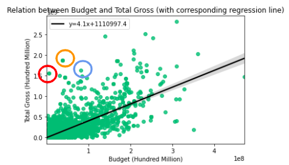
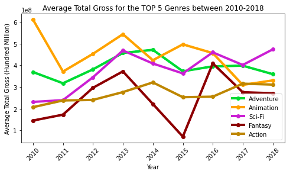
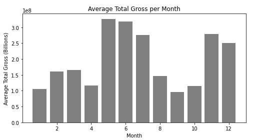

# Movie Industry Trends¶

    

*Sponsored by Microsoft* ;)

**Authors:** [Christos Maglaras](mailto:Christo111M@gmail.com) and [Jamie Dowat](mailto:jamie_dowat44@yahoo.com)

## Overview

In light of Microsoft's desire to expand their enterprise into the movie sector, we have analyzed various aspects of movie data to help develop some insights to help maximize Microsoft's ROI for their potential startup. 

Since we are both relatively unfamiliar with the business end of the industry, supplementary research on the working of the industry as a whole were considered to help drive and focus our analysis. (See hyperlinks in *Next Steps*)

Our insights were from the following categories:
* *Budget vs Total Gross* 
    * Movies such as **Minions**, **Beauty and the Beast (1991)**, and **Rocky** had the greatest ROI.
* *Genre vs Total Gross*
    * The genres that produce the largest total gross (on average) are **Animation, Adventure, and [Sci-Fi](https://www.denofgeek.com/movies/movies-of-the-decade-arrival-and-the-rise-in-popularity-of-smart-sci-fi/)**.
* *Release Month vs Total Gross*
    * On average, the summer months have the highest average total gross.
* *Popularity vs Revenue vs Genre*
    * **Action** movies are the most frequently correlated to growth in popularity if there is a growth in revenue.
* *Movie Runtime*
    * For all genres (generally speaking), an optimal run-time is under 120 minutes.
    * More 'serious' genres have a higher runtime limit (before their 'popularity' decreases)
        * For example, Drama films have the highest runtime threshold, at 220 minutes.
        

## Business Understanding

Beginning a new branch of a business is not easy, especially in the [entertainment sector](https://www.latimes.com/entertainment-arts/business/story/2020-12-09/everything-hollywood-lost-during-the-pandemic). Thankfully, Microsoft is one of the leaders of technology worldwide (has the second highest [brand value](https://www.visualcapitalist.com/the-worlds-tech-giants-ranked/) behind Apple), so distribution of the content should be relatively easy as, for example, Microsoft's in house Azure servers could be employed. This could leed to the development of a *Microsoft streaming service*, which is the route that many competitors have taken; Amazon has Prime Video, Apple has [Apple TV+](https://www.techradar.com/news/did-apple-tv-plus-secretly-become-one-of-the-best-streaming-services-in-2020), and Google owns YouTube. This potentially gives Microsoft an advantage, to enter the rapidly changing market with substantial data to observe from its competitors.  

This notebook's purpose is to provide as much relevant data as is reasonable to aid Microsoft in building a business plan to produce successful movies.

## Unpacking the Data

Data was analyzed from [IMDB](https://www.imdb.com/), [Box Office Mojo](https://www.boxofficemojo.com/), [The Movie Data Base](https://www.themoviedb.org/), [Kaggle](https://www.kaggle.com/rounakbanik/the-movies-dataset?select=movies_metadata.csv) and [The-Numbers.com](https://www.the-numbers.com/).

IMDB, or The International Movie Data Base, is the internet's primary source for general movie and television data. Since 1990, they have collected data from both professional and public sources, with much of their data being generated from their users' activity.

Kaggle is known as one of the most popular websites hosting datasets for use by data scientists, they also create their own content but much of their content is user generated. The main source of data for the Kaggle dataset used in this notebook is IMDb.

Box Office Mojo is an alternate source of data, and was bought by IMDB in 2008.

The Numbers is another alternate source, they aggregate data from the previous sites and more to create datasets of their own. 

# Analysis

*To clarify, 'Total Gross' is the total box office revenue domestically AND internationally.*

## Comparing Budget and Total Gross
We found that **Rocky, Beauty and the Beast (1991), and Minions** had the highest Total Gross to Budget Ratio. These three movies can serve as great references for the biggest movie successes (which Microsoft can aim to emulate).

    

## Comparing Genre and Total Gross

Using the top 5 Genres (determined by genres that had highest Average Total Gross), we focused in on two aspects of the proceeding graph:
1. **The Hunger Games: Catching Fire** is the #1 Sci-Fi movie in 2013 that has the maximum Total Gross to Budget ratio.
2. **Despicable Me 2** is the #1 Animated movie in 2013 that has the maximum Total Gross to Budget ratio.

    

## Comparing Release Month vs. Total Gross

The summer months have the highest average Total Gross.

    

## Runtime Recommendations
In general, movies should stay shorter than 120 minutes.

    

# Business Recommendations

* Make **Action** and **Animated** movies a main part of your repertoire.
* For the above genres, releasing the films in the summer months (esp. May) is optimal.
* When choosing what types and how to go about making a given movie, use the movies with highest “bang for your buck” as a reference. (i.e Use "Despicable Me" as a reference for animated movies)

# Next Steps

* Reconciling the differences in results from different datasets -- the same graphs with different data sometimes revealed different results. (see Final-Notebook)
* Scraping marketing data would've been useful for Microsoft to consider *how* they should divvy up their production budget.
* Examining studio, producer, and actor popularity and their respective overall ROI.
    * Analyzing Box Office success for individual studios to determine which studios have been the most successful at dominating the market.
* Developing a more detailed understanding of [movie market](https://bombreport.com/articles/when-does-a-movie-break-even-at-the-box-office/), especially in the context of the effect of [streaming services](https://www.nytimes.com/2019/05/14/business/media/disney-hulu-comcast.html) on the market. 
* Further understanding of the cash flow in the movie market (i.e how movies can make money for the studio during AND [after](https://www.boxofficemojo.com/chart/top_lifetime_gross/?area=XWW) the release of a film.
* Potentially utilizing [Natural Language Processing](https://machinelearningmastery.com/natural-language-processing/) software/stretegies to collect data from any sources related to movies, to find patterns in movie reviews for films with varying profitability.

## For More Information
Please review our full analysis in our Jupyter Notebook or our presentation.

For any additional questions, please contact [Christos Maglaras](mailto:Christo111M@gmail.com) and [Jamie Dowat](mailto:jamie_dowat44@yahoo.com)

### Repository Structure

    

